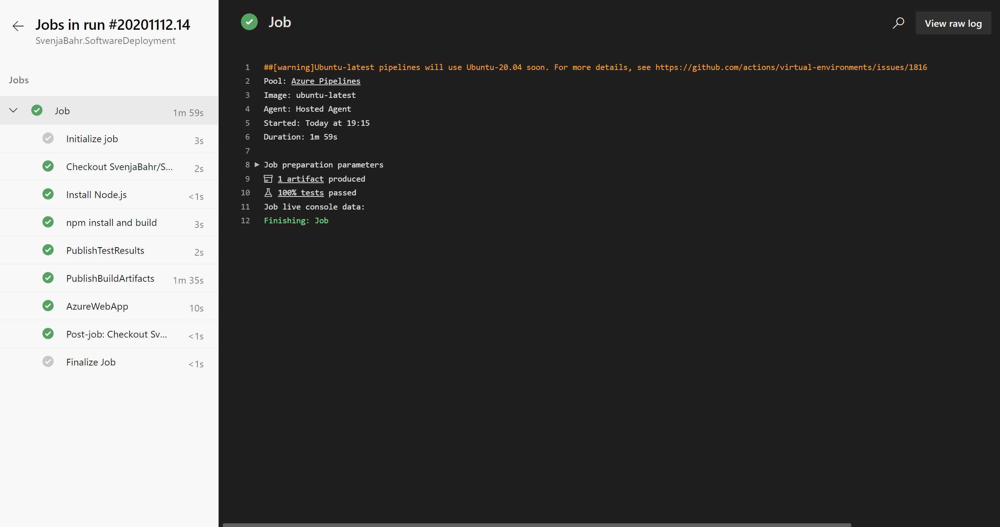
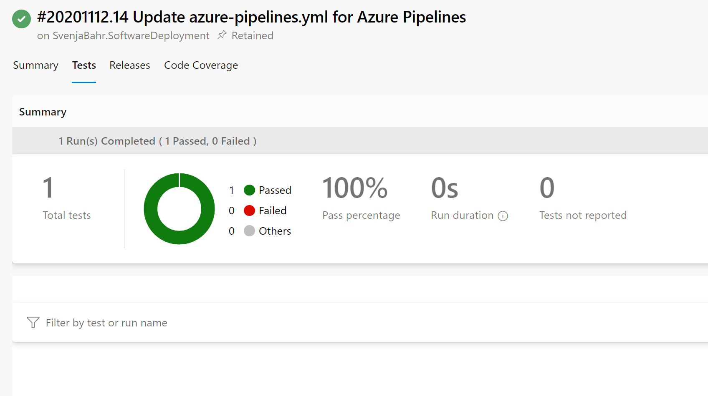
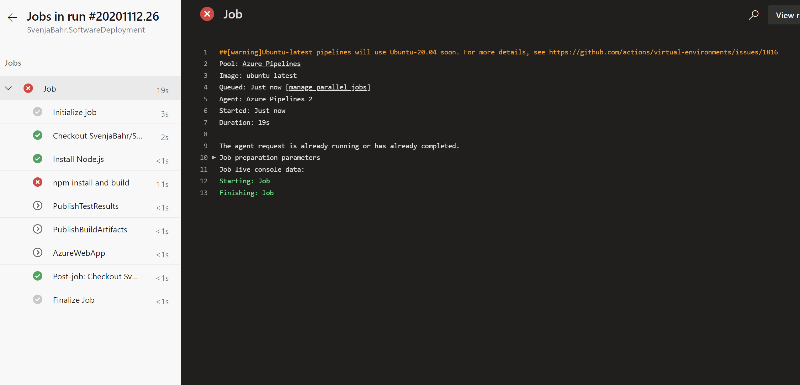
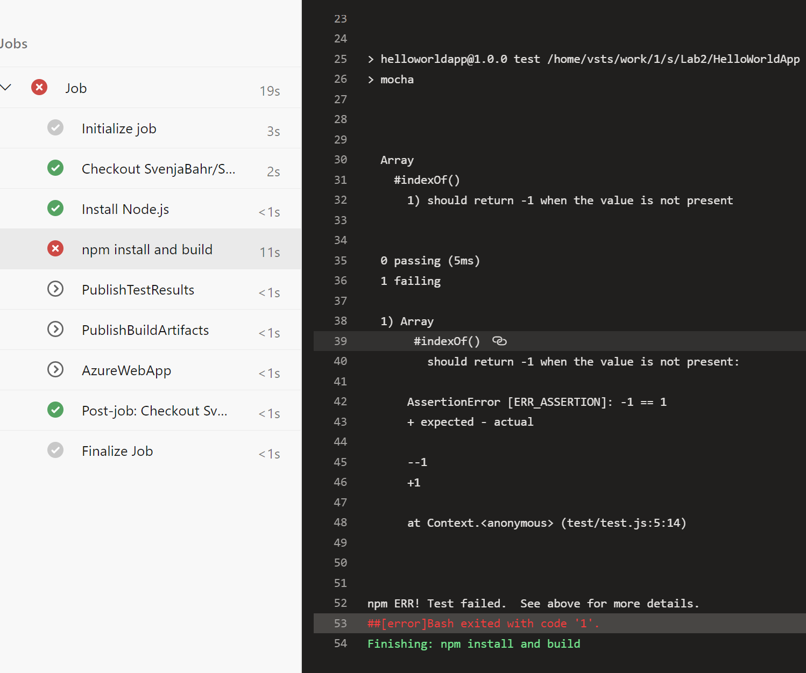
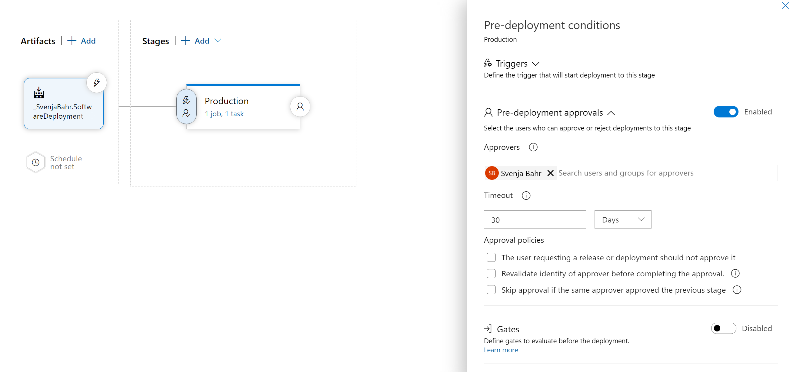
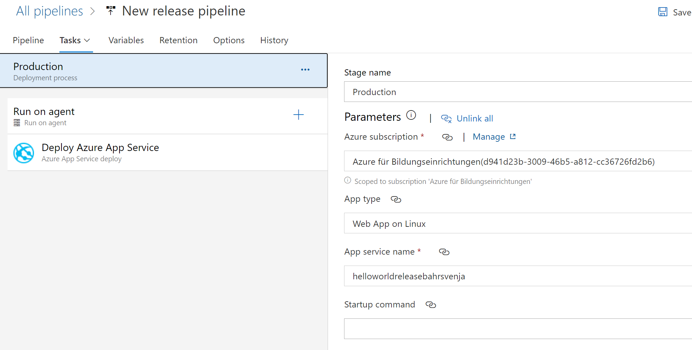
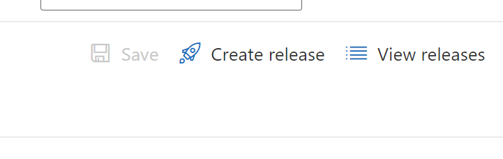
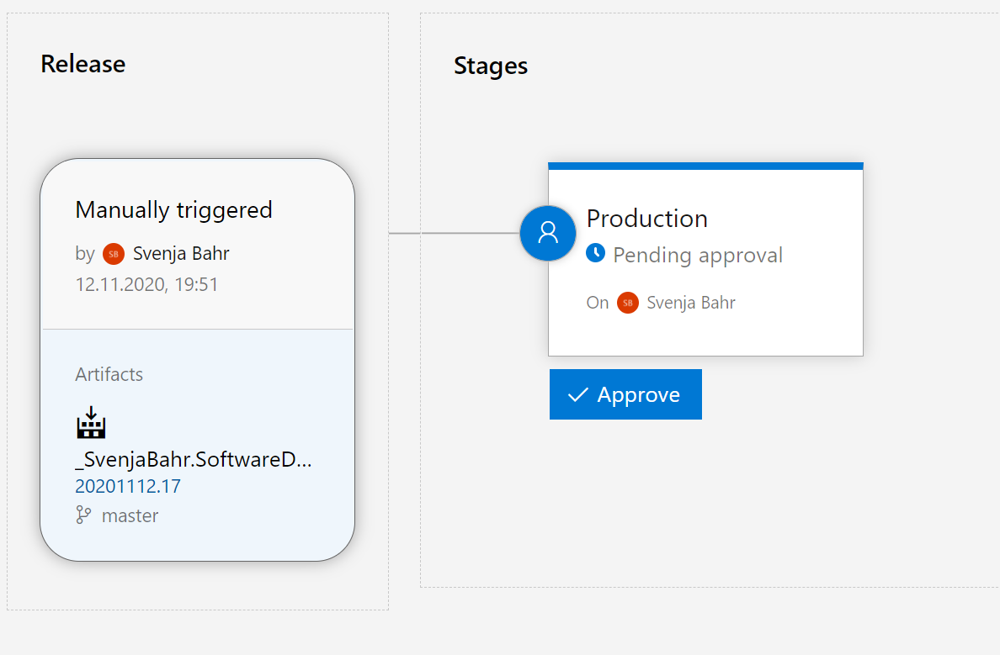
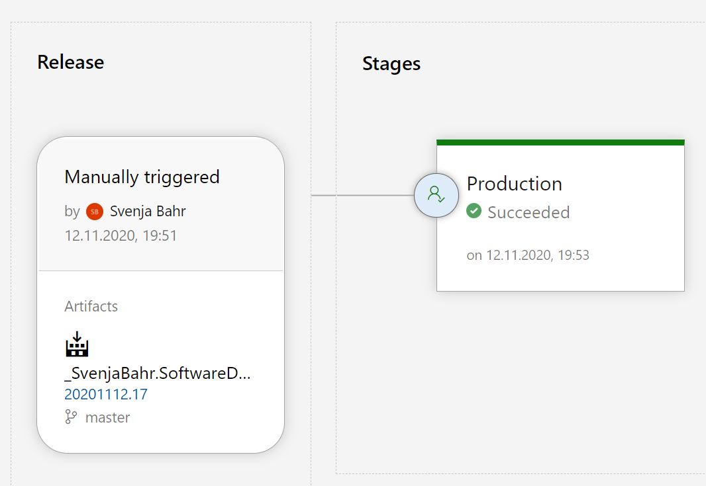
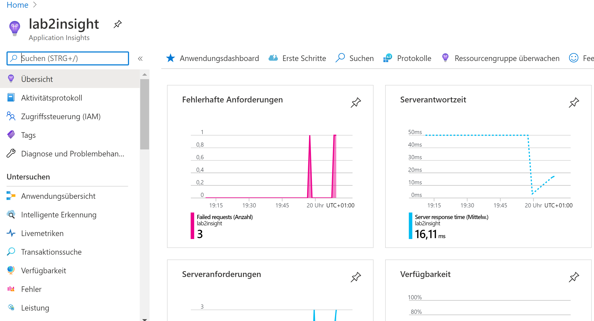

## Azure Web App:

Link dev: https://helloworldbahrsvenja.azurewebsites.net

Link production: https://helloworldreleasebahrsvenja.azurewebsites.net

## Azure DevOps build/Test/Deploy Pipeline

Deployment erfolgreich: 

 

Test erfolgreich: 

 

Deployment fehlgeschlagen:

 

Test fehlgeschlagen: 

 

## Azure DevOps Release Pipeline

 

  

## Dokumentation Release: 

Release erzeugen:

 

 Approve Release:

  

  Succeeded Release: 

   

## Application Insights
Deployment web app mit Application Insights: 

 