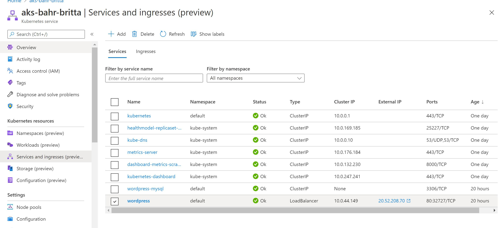

## Lab 4 AKS

### Link

`http://20.73.24.51/`

### Deployment 

At first: login to Azure

`az login`

`az aks create -g lab4-bahr-svenja -n bahraks --node-count 1`

In the next step we are creating an AKS at azure portal in a special resource group. After that we are installing the Kubernetes command-line with: 

`az aks install-cli.`

Additionally, we get the credentials with: 

`az aks get-credentials --resource-group lab4-bahr-svenja --name bahraks`

Now we are creating a secret:

`kubectl create secret generic mysql-pass --from-literal=password=svenjapwd`

In the next step, you have to upload the mysql.yaml and the wordpress.yaml file using the Azure cloud console. But at first, you need to connect to the recently created cluster.

`az account set --subscription [your subscription id]`

`az aks get-credentials --resource-group lab4-bahr-svenja --name bahraks`

Then with the following command, you are able to upload both files.

`kubectl apply -f [path of the file]`

At last, we want the external IP of Wordpress:

`kubectl get services wordpress`

 