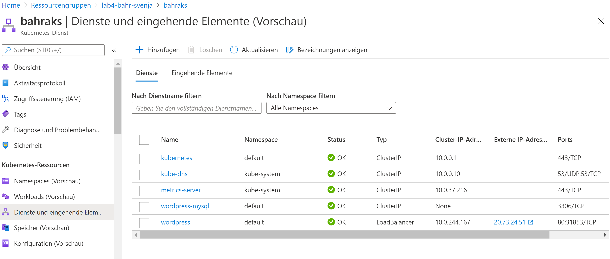

## Lab 4 AKS

### Link

`http://20.73.24.51/`

### Deployment 

Aus ersters in Azure einloggen: 

`az login`

Dannach erstellen wir einen Azure Kubernetes Service in der Resourcengruppe "lab4-bahr-svenja" mit den Namen "bahraks"

`az aks create -g lab4-bahr-svenja -n bahraks --node-count 1`

Anschließend installieren wir die Kubernetes command-line mit: 

`az aks install-cli.`

Dannach führen wir folgenden Befehl aus: 

`az aks get-credentials --resource-group lab4-bahr-svenja --name bahraks`

Weiterhin erstellen wir ein secret:

`kubectl create secret generic mysql-pass --from-literal=password=svenjapwd`

Als nächsten Schritt laden wir die beiden yaml-Dateien hinauf indem wir die Azure cloud console verwenden. Vorher müssen wir uns jedoch zu unserem cluster verbinden mit:

`az account set --subscription [your subscription id]`

`az aks get-credentials --resource-group lab4-bahr-svenja --name bahraks`

Mit folgenden Befehl können wir dann die Dateien hochladen: 

`kubectl apply -f [path of the file]`

Schließlich erhalten wir die external IP von Wordpress mit dem Befehl:

`kubectl get services wordpress`

 